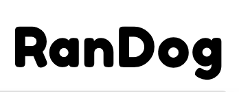
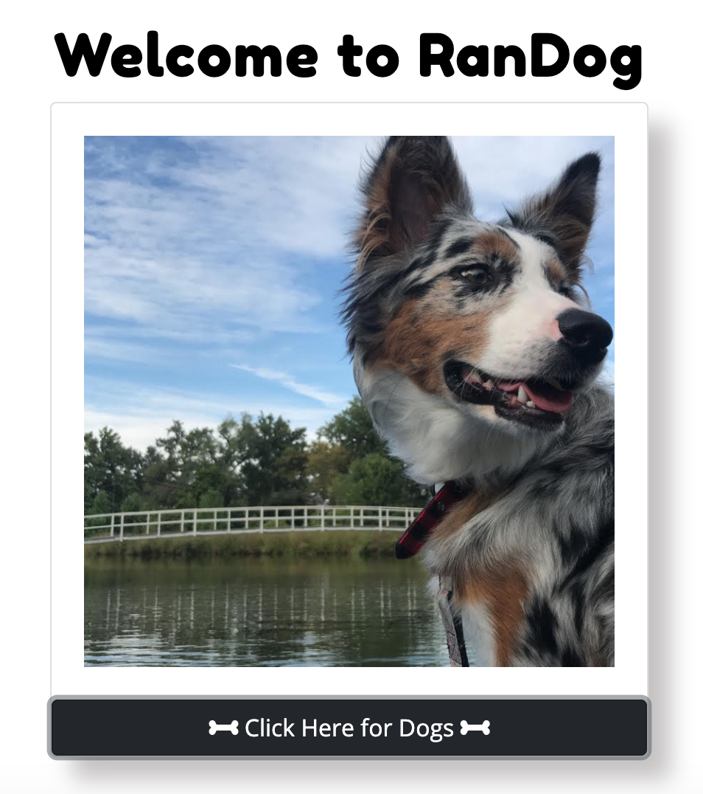

# 

## Description

Using Dog API, RanDog, allows users to view random pictures of dogs at the click of a button.


<!--  -->

## Table of Contents

- [Technologies](#technologies)
- [Usage](#usage)

## Technologies


- HTML
- CSS
- JavaScript
- [Dog API](https://dog.ceo/dog-api/)

## Usage

- [Github Pages](https://bridgetrshannon.github.io/RanDog/)
- [GitHub](https://github.com/bridgetrshannon/RanDog)

```
git clone https://github.com/bridgetrshannon/RanDog.git
```
